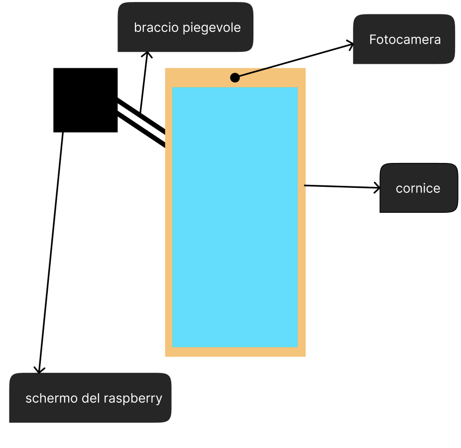

&nbsp;
&nbsp;
# AmbrogioAI - Progetto di Tesi
&nbsp;
&nbsp;
## Intelligenza Artificiale per la riconoscimento di abbigliamento
AmbrogioAI è un progetto di tesi che si propone di creare un'intelligenza artificiale che possa riconoscere il tipo di abbigliamento indossato da una persona in una foto.
Il progetto si divide in due macro-parti:
1. Creazione del DataSet per l'addestramento della Convolutional Neural Network
2. Creazione di un prototipo di specchio smart che integri l'intelligenza artificiale creata
Di fatto lo specchio in fase beta dovrà permettere all'utente di farsi una foto e di ricevere un feedback sull'outfit indossato, in modo tale da poter migliorare il proprio stile, o comunque di avere un confronto con l'intelligenza artificiale per capire se l'outfit scelto è adatto all'occasione, considerando anche che Ambrogio imparerà anche dall'utente e quindi potrà dare consigli più mirati, o comunque più adatti al gusto dell'utente.

## Sketch del prototipo base

Il prototipo sarà così composto:

- Un monitor touch screen
- Una webcam inserita nella cornice dello specchio, collegata ad un Raspberry Pi 4 model B che sarà il cervello dello specchio

Il primo prototipo riceverà un input dall'utente solo tramite lo schermo, in seguito si potrà pensare di aggiungere un microfono per ricevere comandi vocali, o un sensore di movimento per riconoscere la presenza dell'utente e attivare il monitor.

## Insign per i termini 
In questo paragrafo parlerò delle definizioni che la moda dà ai termini "elegante", "casual" e "sportivo".
In base a queste definizioni deciderò quali foto utilizzare al meglio per il dataset, forte del fatto che sarà una scelta il più vicino possibile alla oggettività.
### Elegante

Dal latino elegantia, che sta a significare la capacità di scegliere.
La vera eleganza è inconscia e naturale e ignora le mode, è un dono ed è indipendente dalla classe sociale.
Giorgio Armani in proposito in un’intervista dichiarava: “quando si parla di stile penso sia il vero ed unico lusso che va ricercato, quando si parla di eleganza penso al silenziatore che bisogna mettere all’urlo del trend per conquistarla”.
Con eleganza si intende quindi l'attributo di grazia e semplicità, raffinatezza e buon gusto. 

<a href="https://www.itsmachinalonati.it/dizionario-della-moda#:~:text=Con%20eleganza%20si%20intende%20quindi,semplicità%2C%20raffinatezza%20e%20buon%20gusto.&text=Termine%20inglese%20che%20significa%20moda.">quote di ITS Accademy Macchina Lonati</a>

Inoltre <a href="https://www.vanityfair.it/article/che-cosa-eleganza-citazioni-stilisti#:~:text=in%20Funny%20Face.-,Che%20cos'è%20l'eleganza%3F,la%20moda%20%2D%20infinite%20altre%20sfaccettature.">questo articolo di Vanity Fair</a> contiene diverse definizioni date dai più famosi stilisti, in sintesi l'eleganza per loro è il vestirsi semplici, privi di accessori superflui, per non dare nell'occhio.
Molti tra cui Karl Lagerfeld, Jean Paul Gaultier e Valentino Garavani affermano che l'eleganza è nel carattere della persona, nel portamento che essa ha e non nel vestito;
Tant'è che costoro invidiano chi ha inventato la camicia bianca ed i blu jeans classici, perchè questi capi di abbigliamento sono semplicissimi, ma proprio per questo che sono perfetti per far esaltare l'eleganza di una persona che la possiede "dentro di se". 
#### Conclusioni tratte per il progetto
Ovviamente l'intelligenza artificiale non può sapere che carattere ha la persona in foto, può solo basarsi sul vestiario, quindi per l'eleganza si cercherà di utilizzare foto di persone che indossano abiti semplici, privi di accessori superflui, che non danno nell'occhio ma che allo stesso tempo fanno risaltare la persona che li indossa, valorizzandola in qualche modo.

### Casual

Le origini di questo termine, come descritto <a href="https://www.veneziafc.it/news/le-origini-del-casual-e-del-terrace-style">dall'articolo del Venezia FC</a>, nasce dagli holligans inglesi degli anni 80, che per evitare di essere arrestati, si iniziarono a vestire con i classici capi di abbigliamento da tutti i giorni come classici jeans, maglie semplici, maglioni sobri e sneaker comode.
In realtà il termine casual, ai giorni d'oggi, viene associato comunemente allo street wear, quindi quei capi di abbigliamento che una persona veste per passare il tempo libero, per andare a fare una passeggiata, per andare a fare la spesa, insomma per fare attività che non richiedono un abbigliamento elegante; quindi stiamo parlando di jeans abbinati a felpe, t-shirt e cargo, ecc.

Maggiori informazioni riguardo l'abbigliamento casual ci vengono fornite dal <a href="https://www.bonprix.it/vocabolario-della-moda/casual/#:~:text=Cosa%20significa%20“casual”%3F,maglioni%20sobri%20e%20sneaker%20comode.">vocabolario della moda Bonprix</a>, che ci conferma come un outfit casual deve essere comodo, versatile e disinvolto, ma allo stesso tempo deve essere curato e non trascurato per non cadere nel trasandato, tant'è che con questo tipo di outfit si può andare a lavoro, a scuola, a fare shopping, insomma in qualsiasi occasione che non richieda un abbigliamento elegante.
#### Conclusioni tratte per il progetto
Per il casual verranno selezionate delle immagini nelle quali il soggetto indossa capi di abbigliamento comodi, come polo,jeans baggy e non, felpe, t-shirt, scarpe da ginnastica, insomma capi che si possono indossare in qualsiasi occasione, senza però cadere nello stile sportivo.

### Sportivo

Questa tipologia di outfit è quella che si indossa per fare attività fisica e/o avere la massima comodità che un capo di abbigliamento può offire.
Un outfit sportivo è composto da capi comodi, realizzati con tessuti tecnici, che permettono di muoversi liberamente e di assorbire il sudore.
Inoltre si può includere anche l'abbigliamento da sci, da trekking, da corsa, da palestra, insomma tutto ciò che è realizzato per fare attività fisica, ma che può essere indossato anche per stare comodi in casa quindi la tuta ad esempio.

&nbsp;
&nbsp;

&nbsp;
&nbsp;

## Ricerca di progetti simili
Nel 2019 è stato pubblicato un articolo su <a href="https://forbes.it/2019/06/10/come-funziona-lo-shazam-per-i-vestiti-creato-da-amazon/">Forbes</a> che parla di un progetto di Amazon che ha creato un'applicazione che permette di riconoscere il tipo di abbigliamento indossato da una persona in una foto, in modo tale da poterlo acquistare direttamente dall'applicazione, in realtà non è proprio come il mio progetto dato che loro intendono riconoscere i capi di abbigliamento per poi venderli, mentre io voglio riconoscere il tipo di abbigliamento indossato per capire se la persona in foto è elegante, casual o sportiva.
Un progetto già molto più simile è fashion++ ideato da Facebook, sempre nel 2019.
Mark Zuckerberg ha presentato questo progetto alla International Conference on Computer Vision (ICCV) tenutasi a Seoul, in Corea del Sud, che permette di riconoscere il tipo di abbigliamento indossato da una persona in una foto e di dare consigli su come migliorare l'outfit, magari rimuovendo un accessorio superfluo o aggiungendone uno che valorizzi la persona in foto, oppure può consigliare di mettere la maglia sotto ai pantaloni o ,ancora , di tirarsi su le maniche ecc...

## Specchi Smart e Intelligenza Artificiale
Non ho trovato specchi smart che hanno una intelligenza artificiale integrata nello specchio che offre gli stessi servizi che offrirebbe AmbrogioAI, molti specchi però hanno l'integrazione con Amazon Alexa, che quindi permette di fare domande all'intelligenza artificiale di Amazon, ma non di fare riconoscimento di abbigliamento.

&nbsp;
&nbsp;

&nbsp;
&nbsp;

## Creazione del DataSet per l'addestramento della Convolutional Neural Network
###  Problema
Il problema che si vuole risolvere è quello di creare un dataset di immagini di persone che indossano abiti eleganti, casual e sportivi, per poi addestrare una rete neurale convoluzionale che possa riconoscere il tipo di abbigliamento indossato dalla persona in una foto.
Le foto devono essere fatte come se il soggetto in foto si stia specchiando dato che la stessa inteligenza artificiale dovrà riconoscere il tipo di abbigliamento indossato dalla persona in una foto scattata con una webcam installata in uno specchio.
Per avere un dataset ottimale mi aspetto di avere almeno 1200 immagini, ovvero 400 per classe, oppure per avere un dataset sufficiente ci si aspetta 900 immagini, ovvero 300 per classe.

## Organizzazzione dei dati
I dati sono organizzati in un sistema a cartelle presente nella repository git del progetto (<a href="https://github.com/AmbrogioAI/DataSet">clicca qui per accedere alla repository</a>), ogni cartella chiamata in base alla classe di appartenenza delle immagini in esse contenute, inoltre nella root del progetto è presente un file .json che contiene i nomi delle singole immagini associate alla loro classe, e questo file il punto d'accesso per la lettura dei dati da parte della rete neurale.
